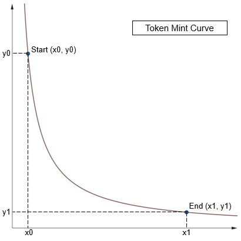

# **Just Mint Whitepaper**

## **1. Introduction**

The blockchain ecosystem has revolutionized the way digital assets are created, distributed, and managed. However, the process of minting new tokens often lacks transparency, simplicity, and fairness. **Just Mint** aims to address these issues by introducing a standardized protocol for token minting, providing a decentralized application (DApp) for seamless user interaction, and launching the first token, **Just Mint Token (JSMT)**, as a proof of concept.

**Just Mint** is a comprehensive framework consisting of three main components:

1. **Just Mint Protocol**: A set of rules and algorithms defining how tokens are minted using a virtual liquidity curve.
2. **Just Mint Application**: A user-friendly DApp that implements the Just Mint Protocol, allowing users to create and manage tokens effortlessly.
3. **Just Mint Token (JSMT)**: The inaugural token minted according to the Just Mint Protocol, serving as a live demonstration of the system’s capabilities.

## **2. Just Mint Protocol**

### **2.1 Minting Curve**

The **Just Mint Protocol** leverages a virtual liquidity curve to govern token minting. The curve is defined by the formula:

```math
x * y = k
```

Where:
- **x**: Amount of base token (Token X) used for minting.
- **y**: Amount of new token (Token Y) available for minting.
- **k**: Constant representing the product of x and y.

<figure>
  <div align="center">
    
  </div>
  <figcaption>
    <div align="center">
      <p>Just Mint Curve</p>
    </div>
  </figcaption>
</figure>


#### **Configuration**

Token creators configure minting using two points on the liquidity curve:
- **Start Point (x0, y0)**: Defines the initial state.
- **End Point (x1, y1)**: Defines the cap and end state.

#### **Minting Output Calculation:**  
When a user pays **x'** amount of Token X, the minted output **y'** is calculated as:

```Math
y' = y - \frac{x_0 * y_0}{x + x'}
```


#### **Key Parameters:**
- **Supply Cap (y1 - y0)**: Maximum supply of Token Y.
- **Total Payment (x1 - x0)**: Total Token X required to mint the full supply.
- **Initial Minting Price (x0 / y0)**: Price at the start of minting.
- **Ending Minting Price (x1 / y1)**: Price at the end of minting.

### **2.2 Liquidity Pool**

Once tokens are minted, a liquidity pool can be created using Token X and Token Y. Key aspects include:

- **Single Pool Creation**: Only one liquidity pool per token is permitted.
- **Creator Control**: The pool creator sets initial prices, fee rates, and other parameters.

### **2.3 Buy & Burn Mechanism**

To ensure a deflationary model, the protocol introduces a buy-and-burn mechanism:

- **Threshold (Xt)**: When the DApp receives Token X exceeding the threshold (Xt), users can use these funds to buy Token Y from the liquidity pool.
- **Burning Tokens**: Purchased Token Y is permanently burned, reducing total supply.
- **Final Supply**: Once all Token X is used for buy-and-burn, the remaining Token Y represents the final circulating supply.

## **3. Just Mint Application**

The **Just Mint Application** provides a user interface to interact with the protocol’s smart contracts. It enables users to:

1. **Create New Tokens**: Define and launch new tokens using the Just Mint Protocol.
2. **Mint Tokens**: Convert Token X into newly minted Token Y.
3. **Create Liquidity Pools**: Establish trading pools for Token X and Token Y.
4. **Buy & Burn Tokens**: Utilize collected Token X to purchase and burn Token Y.

### **3.1 Third-Party Integration:**
- Users can trade Token Y on any decentralized exchange (DEX) of their choice.

### **3.2 Fee Structure:**
- **Initial Phase**: Token creation is free.
- **Future Plans**: A nominal creation fee will be introduced as the application matures.

## **4. Just Mint Token (JSMT)**

The **Just Mint Token (JSMT)** is the first token minted using the Just Mint Protocol, showcasing the protocol’s functionality and benefits.

### **4.1 Token Configuration:**
- **Base Token (X)**: Wrapped SOL (WSOL)
- **New Token (Y)**:
  - **Name**: Just Mint Token  
  - **Symbol**: JSMT  
  - **Decimals**: 6  

### **4.2 Minting Parameters:**
- **Start Point (x0, y0)**: 10 WSOL, 11 Billion JSMT
- **End Point (x1, y1)**: 110 WSOL, 1 Billion JSMT
- **Threshold (Xt)**: 0.1 WSOL

## **5. Advantages of Just Mint**

1. **Transparency**: Clear and predictable minting rules.
2. **Decentralization**: Anyone can create tokens without central authority.
3. **Deflationary Mechanism**: Buy-and-burn ensures long-term value.
4. **User-Friendly**: Intuitive DApp for easy interaction with the protocol.
5. **Interoperability**: Tokens can be traded on any DEX.

## **6. Conclusion**

**Just Mint** offers a revolutionary approach to token minting, providing transparency, simplicity, and fairness. By combining a robust protocol, an intuitive application, and a live demonstration through **Just Mint Token (JSMT)**, **Just Mint** is poised to become a foundational tool in the blockchain ecosystem.


## References
[1] https://app.uniswap.org/whitepaper-v3.pdf


